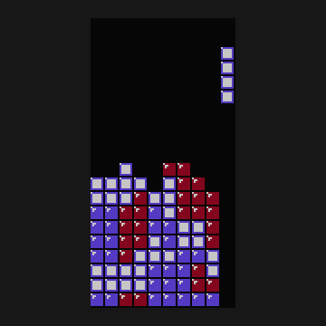

# Tetris Screensaver
An NES-style Tetris screensaver for Windows.

## SECURITY WARNING
Any screensaver that is installed on your computer has administrator privileges! A malicious screensaver can steal your data and cause serious harm to your computer. You should download screensavers only from sources that you trust.

## Installation
1. Download the latest release.
2. Move the file to `C:\Windows\System32`. You will need adminstrator privileges. Please read the SECURITY WARNING.
3. Open the Screen Saver Settings dialog. On Windows 11, open Settings, then go to Personalization->Lock screen->Screen saver.
4. You should know the rest.

To uninstall the screensaver, simply remove the file from `C:\Windows\System32`.

## Building
You need [SDL2](https://www.libsdl.org/) to build the project. On Windows, keep the SDL2 `bin`, `include`, and `lib` directories in the same directory. Add the `bin` directory to the "Path" environment variable. When you run the Makefile, the compiler will look for these directories.

## Notes
- This screensaver cannot be viewed inside the Screen Saver Settings window. You will need to click "Preview".
- There are no configuration options for this screensaver. Clicking on "Settings..." will do nothing.
- This screensaver is only intended to look cool. I do NOT recommend running this on CRT monitors or OLEDs.
- This screensaver does NOT support more than one monitor at a time.
- This screensaver works on Windows 10 and 11. It might not run on older versions of Windows without changes to the code.
